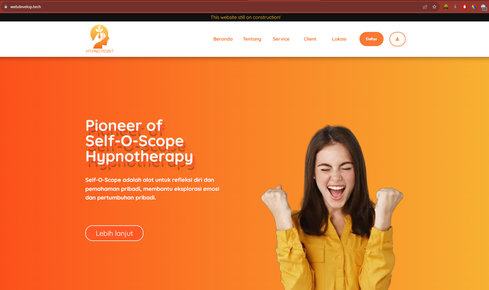
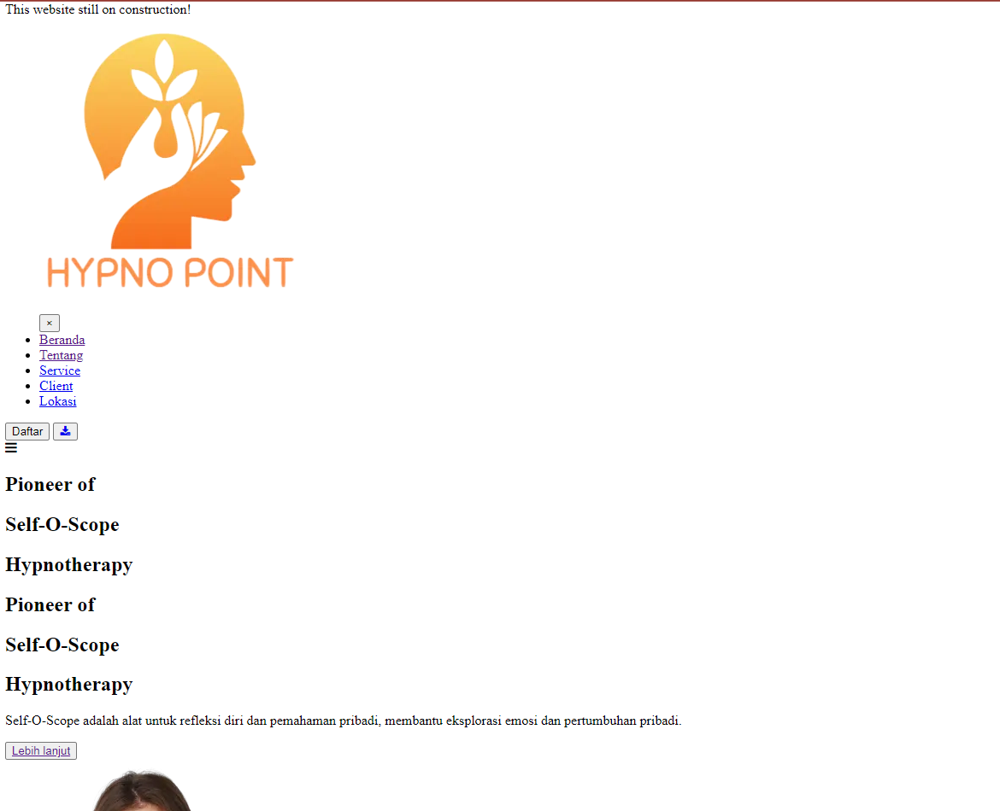
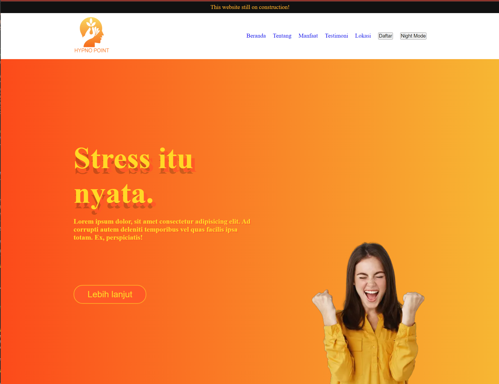
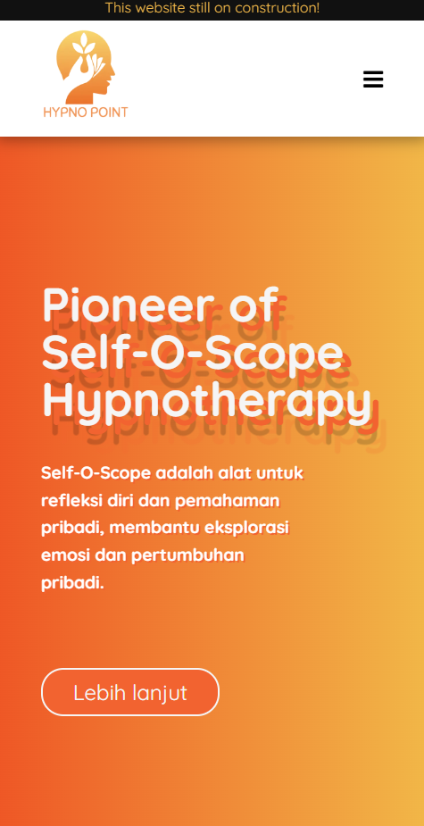

[](https://classroom.github.com/a/_e9whi2b)

<a href="" ></a>

Company profile Hypno Point, dan metode Self-O-Scope. Self-O-Scope adalah alat untuk refleksi diri dan pemahaman
pribadi, membantu eksplorasi emosi dan pertumbuhan pribadi.

[](https://www.linkedin.com/in/adrisa-syarif/)
[](https://www.instagram.com/adsyarif/)
[](mailto:adsyarif28@gmail.com)

<!-- [](https://www.youtube.com/@MuhammadAvicena) -->

## STRUCTURE 📰

- Header
  - Announcement
  - Navbar
  - Hero section
- Main
  - Profile section
  - Method section
  - Services section
  - Client section
- Footer
  - Location Section

## INGREDIENTS I USE 📜

Design

- Adobe Color Whell

Production

- HTML
- CSS
- JavaScript
- External/Internal Source
  - font awesome
  - Image

## HOW TO SET UP 📰

You will need a github account to clone this repository, make sure you're connected to github.

1. Clone this repository

```
git clone https://github.com/revou-fsse-3/milestone-1-Adrisa.git
```

2. Develope & modify the website with your personal information, once it's done you will need to push it. But, before doing that, you have to make your own repository on your github. Just follow this [instruction](https://docs.github.com/en/get-started/quickstart/create-a-repo).

```
git remote origin set-url <your-repository>
git remote --v // check your remote repo
git add .
git commit -m "update message" // make sure to give details commit message to get better logs
git push origin main
```

# Development

This website have 3 step of development.

1. Design
   i. Design the logos
   The logo design choosen by the phylosophy company.
   ii. Design the layout
   The layout have minimalist design to make user ease to catch up the information.
   iii. Design the color palete
   The collor palet use analog color combination. It make the color more coherent.

2. Production
   i. Code HTML

   <br/> <br/>

   ii. Code CSS

   <br/> <br/>
   <br/> <br/>

   iii. Code Javascript

3. Deployment
   i. Niaga Hoster
   ii. Vercelapp

# Contributor

1. Muhammad Adrisa Nur Syarif as a programmer
2. Bayu Noviadi as a client
